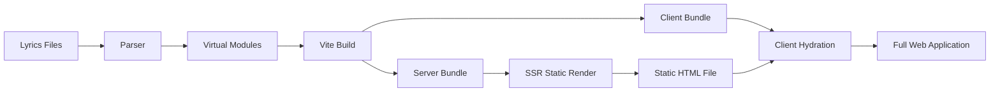

# Lyri

> A Static Site Generator.

## 愿景

快速构建自己的私人歌词本。

## 构建流



## 快速开始

### 安装

```bash
# 克隆项目
git clone https://github.com/elecmonkey/lyri
cd lyri

# 安装依赖
pnpm install

# 构建工具
pnpm build:node
```

### 开发

```bash
# 启动开发服务器
node bin/lyri.js dev
```

### 构建

```bash
# 构建静态网站
node bin/lyri.js build

# 预览构建结果
node bin/lyri.js preview
```

## 当前状态

Demo，开发中。

## 许可证

MIT License